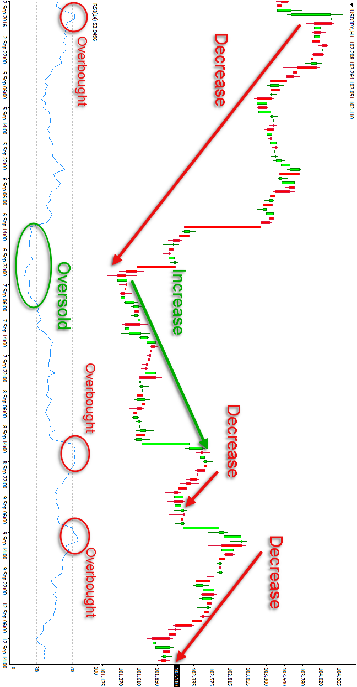
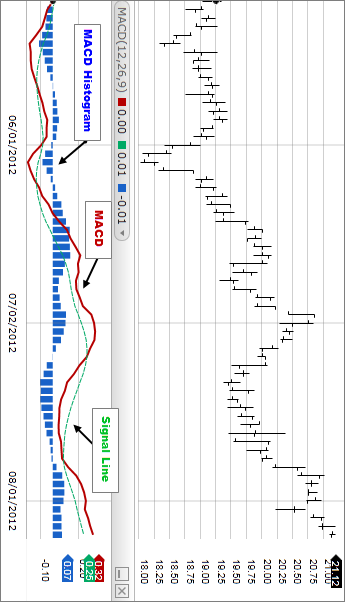

```{r}
setwd("\Users\Administrator\Desktop\Quantmod II")
```


```{r setup, include=FALSE}
knitr::opts_chunk$set(echo = TRUE)
```


```{r}
library(tidyverse)
library(quantmod)
library(PerformanceAnalytics)
library(RColorBrewer)
library(tseries)
library(lubridate)
library(Quandl)
Quandl.api_key("zrcB2Ejv9UmvhPCUsy2_")


```


#Review of last Project (i.e., Ad, Cl, getsymbols, etc.)

```{r}
msft <- getSymbols("MSFT", auto.assign = F)
head(msft)
tsla <- getSymbols("TSLA", auto.assign = F)
tsla_daily_return <- dailyReturn(tsla$TSLA.Adjusted)
head(tsla)
```


# Charting

#Line Graph

```{r}
msft <- getSymbols("MSFT", auto.assign = F)
chartSeries(msft,
            subset = "2007",
            TA = "addBBands(n = 20, sd =2)",
            theme = chartTheme("black"))
```

#Candlestick

```{r}
chartSeries(msft,
            type = "candlestick",
            subset = "2013",
            theme = chartTheme("black"))
```


#Line Graph

```{r}
msft <- getSymbols("MSFT", auto.assign = F)
chartSeries(msft,
            type = "line",
            subset = "2013",
            theme = chartTheme("black"))
```


#RSI

```{r pressure, echo=FALSE, fig.cap="A caption", out.width = '100%'}

```

```{r}
msft <- getSymbols("MSFT", auto.assign = F)
chartSeries(msft,
            type = "line",
            subset = "2007",
            TA = c(addBBands(n = 20, sd =2), addRSI()),
            theme = chartTheme("black"))
```


#MACD


```{r}

msft <- getSymbols("MSFT", auto.assign = F)
chartSeries(msft,
            type = "line",
            subset = "2007",
            TA = c(addBBands(n = 20, sd = 2), addRSI(), addEMA(n = 30), addMACD()),
            theme = chartTheme("black"))
```


#Others


Next Project:  We will use technical indicators to create buy and sell signals.  


