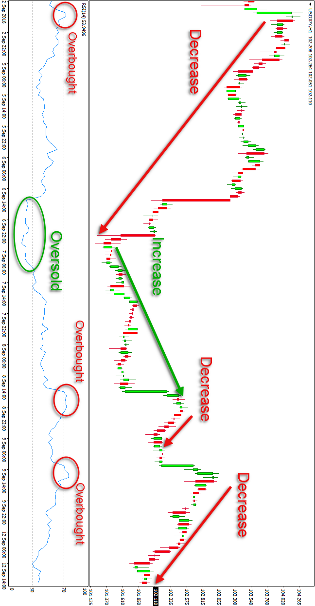

```{r}
setwd("\Users\Administrator\Desktop\Quantmod II")
```


```{r setup, include=FALSE}
knitr::opts_chunk$set(echo = TRUE)
```


```{r}
library(tidyverse)
library(quantmod)
library(PerformanceAnalytics)
library(RColorBrewer)
library(tseries)
library(lubridate)
library(Quandl)
Quandl.api_key("zrcB2Ejv9UmvhPCUsy2_")


```


#Review of last Project (i.e., Ad, Cl, getsymbols, etc.)

```{r}

```


# Charting

#Line Graph

```{r}

```

#Candlestick

```{r}

```


#Bollinger Bands

```{r}

```


#RSI

```{r pressure, echo=FALSE, fig.cap="A caption", out.width = '100%'}

```

```{r}

```


#EMA


```{r}

```


#Others


Next Project:  We will use technical indicators to create buy and sell signals.  


